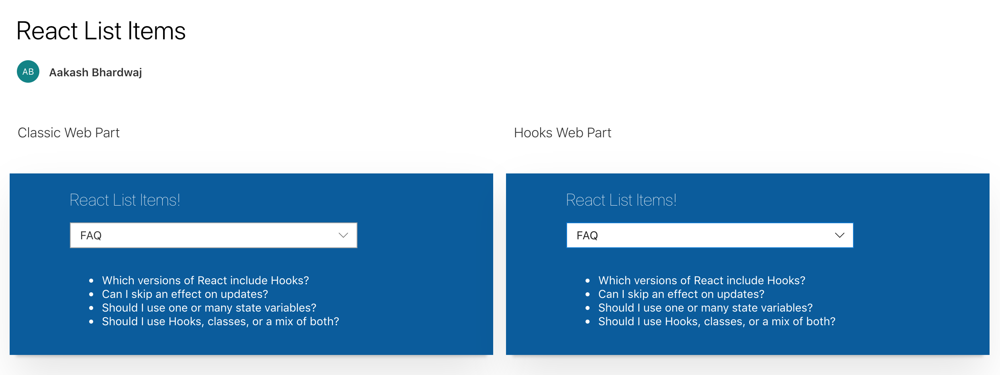

# React List Items

## Summary
This sample web part shows how a SharePoint list's items can be fetched and rendered using one web part that uses React class components and another one that uses functional components and built-in *useState*, *useEffect* and *useContext* Hooks.

## Used SharePoint Framework Version

## Applies to

* [SharePoint Framework](https://dev.office.com/sharepoint)
* [Office 365 tenant](https://dev.office.com/sharepoint/docs/spfx/set-up-your-development-environment)

## Prerequisites

There are no pre-requisites.

## Solution

Solution|Author(s)
--------|---------
react-list-items | [Aakash Bhardwaj](https://twitter.com/aakash_316)

## Version history

Version|Date|Comments
-------|----|--------
1.0| May 3, 2020|Initial release

## Disclaimer

**THIS CODE IS PROVIDED *AS IS* WITHOUT WARRANTY OF ANY KIND, EITHER EXPRESS OR IMPLIED, INCLUDING ANY IMPLIED WARRANTIES OF FITNESS FOR A PARTICULAR PURPOSE, MERCHANTABILITY, OR NON-INFRINGEMENT.**

---

## Minimal Path to Awesome

* Clone this repository
* `npm install`
* `gulp bundle --ship`
* `gulp package-solution --ship`
* Add to Site Collection App Catalog and Install the App
